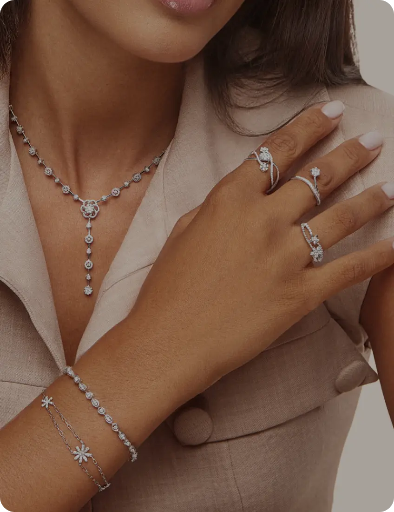
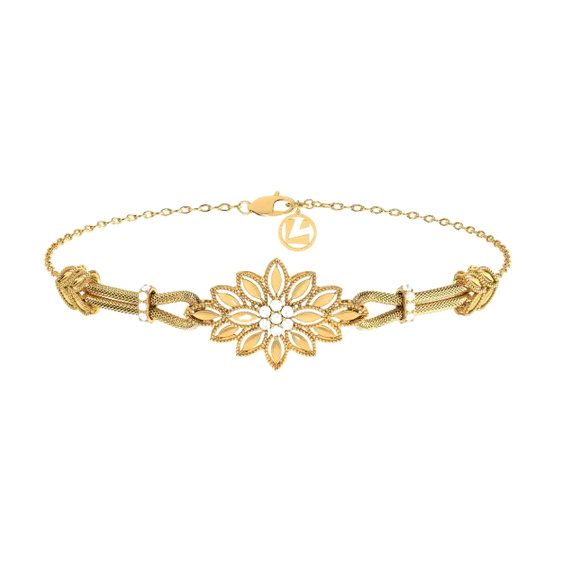
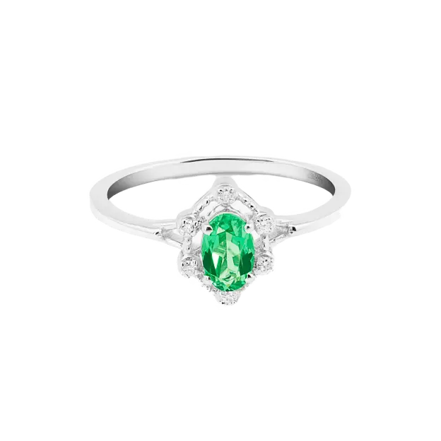
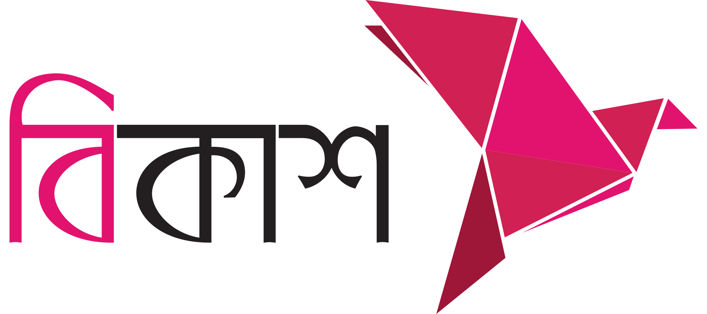
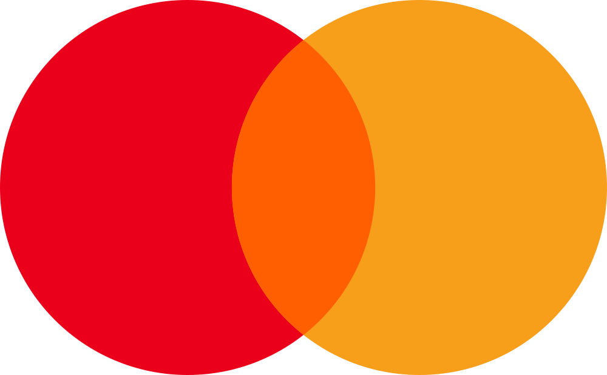

<div align="center">


# ✨ Sha Jalal Jewellery Storefront ✨

_A premium, bilingual (EN/BN) e‑commerce frontend crafted with Next.js — where every pixel sparkles like a diamond._

<br/>


</div>

---

```
╔══════════════════════════════════════════════════════════════════════╗
║    ✦   A stunning, fully-responsive jewellery store experience   ✦   ║
╚══════════════════════════════════════════════════════════════════════╝
```

## 💎 Features

| 🌟 Preview | 🛍️ Shopping | 🇧🇩 Localised |
| --- | --- | --- |
| Elegant hero with product banners | `Shop by Category` megamenu | English & বাংলা switching |
| Popular-By-Categories grid | Product quick-view & gallery | Locale-aware routes `(/en / /bn)` |
| Best Items, Discover & Promo sections | Wishlist ❤️ + Cart (Zustand) | Right-to-left friendly layout |
| Video showcase & blog preview | Premium 3-column checkout | Formatted prices & dates |
| Trust badges & newsletter | **bKash / Nagad / Rocket / Visa / Mastercard / COD** | Designed for the BD market |

## 🖼️ A Glimpse

<div align="center">

| | |
| --- | --- |
|  |  |
|  |  |

</div>

## 🧰 Tech Stack

| Area | Technology |
| --- | --- |
| Framework | **Next.js 16** (App Router, Server Components) |
| Language | TypeScript *(strict)* |
| Styling | Tailwind CSS + shadcn/ui (Base UI / Radix primitives) |
| Icons | Lucide React |
| i18n | next-intl (en + bn) |
| State | Zustand (cart, wishlist persistence) |
| Forms/Validation | React Hook Form + Zod 4 |
| HTTP | Axios |
| QR | qrcode.react (invoice receipts) |

## 📁 Structure

```
frontend/
├── app/
│   └── [locale]/
│       ├── (public)/              # Public shell (Header/Footer)
│       │   ├── shop/[category]    # Category listing
│       │   ├── shop/[category]/[slug]  # Product detail
│       │   ├── cart               # Shopping cart
│       │   └── checkout           # Address → Delivery → Payment
│       └── page.tsx               # Landing page
├── components/
│   ├── common/  ui/  layout/  sections/
│   ├── checkout/                  # OrderSummary, ThankYouView, InvoiceView…
│   ├── shop/                      # ProductCard, ProductGallery, ShopCatalog…
│   └── product-single/            # Premium product detail blocks
├── features/                      # shop, search, home, checkout logic
├── store/                         # Zustand stores (cart, wishlist)
├── messages/                      # en.json, bn.json
├── public/images/unimart/  payments/ …
└── [locale] root layout, next.config.ts, tsconfig.json
```

## 🚀 Quick Start

```bash
npm install
npm run dev        # → http://localhost:3000
```

| Command | What it does |
| --- | --- |
| `npm run lint` | ESLint |
| `npm run build` | Production build |
| `npm run start` | Serve production build |
| `npm run format` | Prettier (write) |

## 💳 Payments We Accept

| bKash | Nagad | Rocket | Visa | Mastercard | COD |
| --- | --- | --- | --- | --- | --- |
|  |  |  |  |  | 💵 Cash on Delivery |

---

## 👑 Presented By

<div align="center">

```
 █████    ██   ██    █████                  ██    █████    ██         █████    ██
██   ██   ██   ██   ██   ██                 ██   ██   ██   ██        ██   ██   ██
██        ███████   ██   ██                 ██   ██   ██   ██        ██   ██   ██
 █████    ██   ██   ███████                 ██   ███████   ██        ███████   ██
     ██   ██   ██   ██   ██            ██   ██   ██   ██   ██        ██   ██   ██
██   ██   ██   ██   ██   ██            ██   ██   ██   ██   ██        ██   ██   ██
 █████    ██   ██   ██   ██             █████    ██   ██   ███████   ██   ██   ███████
```

**`✦ Design & Development By Shajalal ✦`**

_Crafted with 💛 & meticulous attention to detail_

</div>

<div align="center">

<br/>

**© 2026 · Sha Jalal Jewellery Storefront** · All rights reserved

</div>